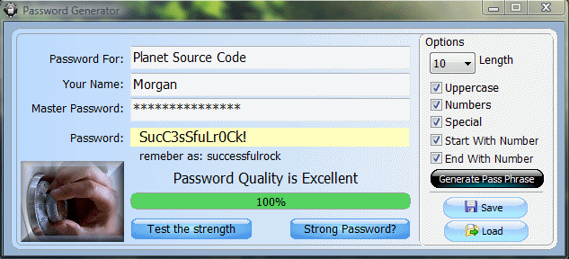



## Password Generator and Quality Tester

### Description

Picking and remembering strong passwords is a pain. It's easier to convert an easy to remember one.

Easily create passwords to your specifications with this password-generation tool. Enter a master password, a URL or keyword, and a user name. Select the password length and click a few options to get a unique password. What this program does is use an algorithm to make a password based on the seed data. Enter your master password, the URL or keyword, and user name anytime you need to see the password for that site and user. The app takes an extra step by storing URLs when requested. It's more secure than apps that simply store passwords. The app also has an encryption key that can be changed before compiling so that no two compiled apps return the same password. (Update: Added Printing, updated button control, and Pass Phrase.)
 
### More Info
 

             |
---                |---
**Submitted On**   |2009-03-11 10:49:22
**By**             |[Morgan Haueisen](https://github.com/Planet-Source-Code/PSCIndex/blob/master/ByAuthor/morgan-haueisen.md)
**Level**          |Advanced
**User Rating**    |4.5 (27 globes from 6 users)
**Compatibility**  |VB 6\.0
**Category**       |[Complete Applications](https://github.com/Planet-Source-Code/PSCIndex/blob/master/ByCategory/complete-applications__1-27.md)
**World**          |[Visual Basic](https://github.com/Planet-Source-Code/PSCIndex/blob/master/ByWorld/visual-basic.md)
**Archive File**   |[Password\_G2146513112009\.zip](https://github.com/Planet-Source-Code/morgan-haueisen-password-generator-and-quality-tester__1-71362/archive/master.zip)

